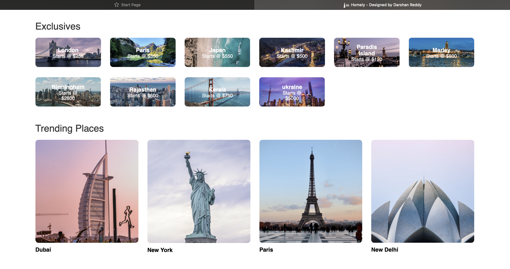
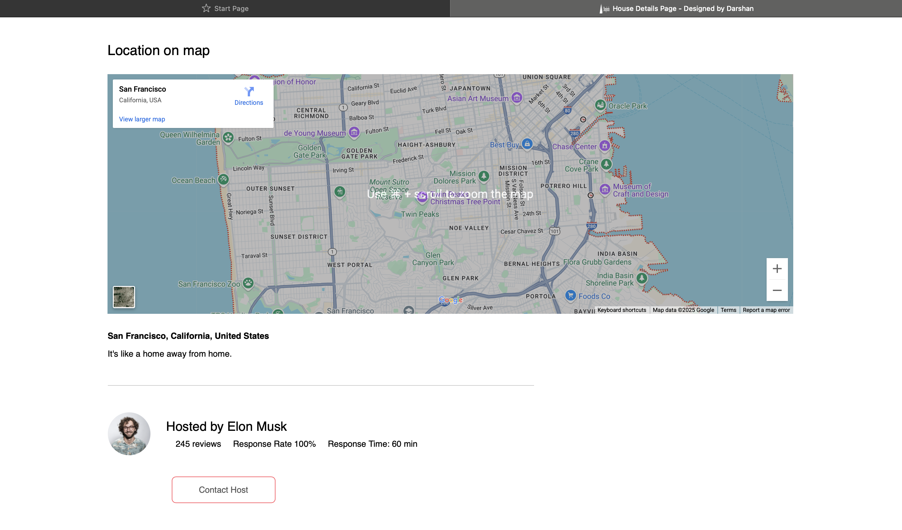
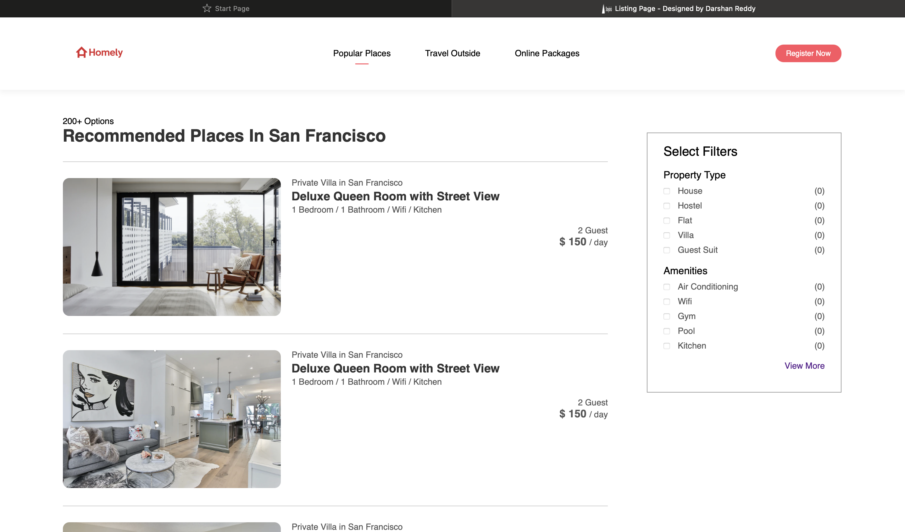
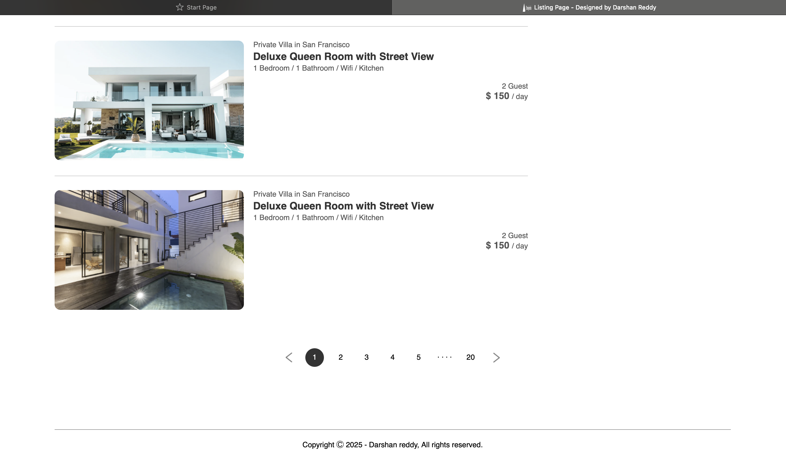
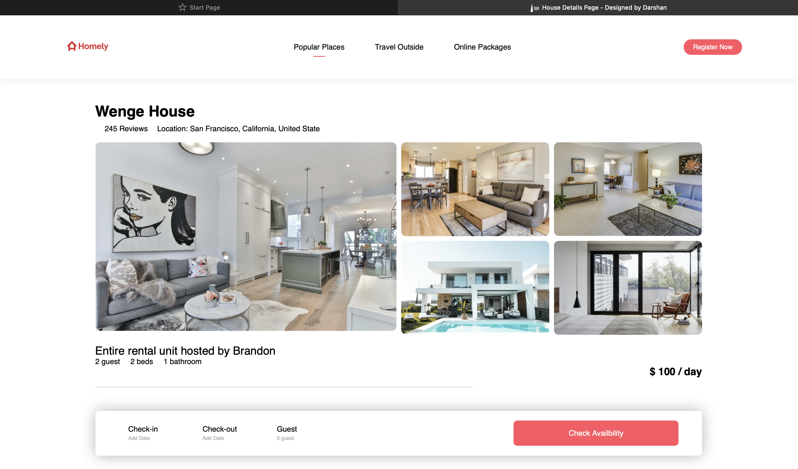
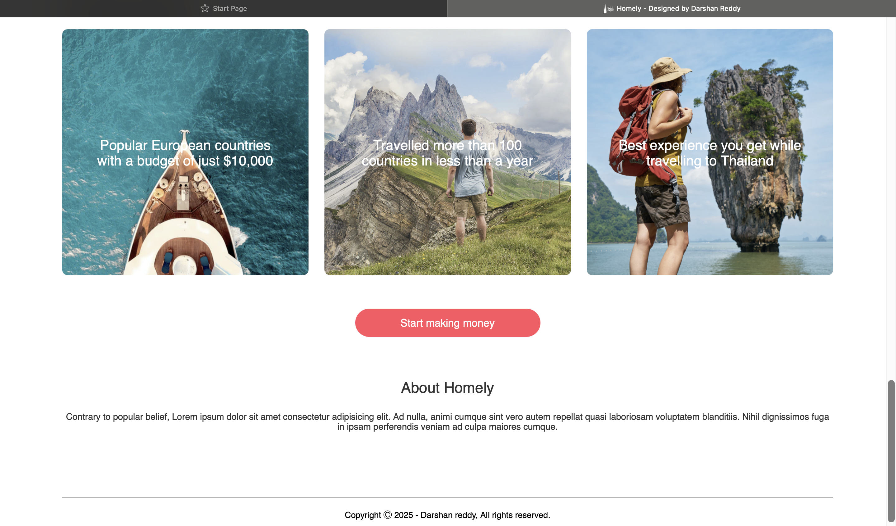

🏡 Homely – Your Next Stay Awaits
Homely is a modern Airbnb-inspired frontend project built with HTML, CSS, and JavaScript.
It provides a beautiful and responsive user interface for browsing properties, trending travel locations, and property details.
This is a frontend-only project—perfect for showcasing design, layout, and user experience.

Live Preview: Homely

✨ Features
🏠 Landing Page: Hero section with location, check-in, and guest search bar

🌎 Exclusive & Trending Places: Showcasing popular and trending destinations

🏡 Property Details Page: Image gallery, property info, reviews, and Google Maps integration

📋 Listings Page: Browse multiple property options with filters

🎨 Responsive Design: Works seamlessly on desktop and mobile devices

⚡ Lightweight & Fast: Pure HTML, CSS, and JavaScript—no frameworks required

🛠 Tech Stack
HTML5 – Page structure

CSS3 / Flexbox / Grid – Styling and responsive layouts

Vanilla JavaScript – Interactivity (buttons, search bar, modals)

Google Maps Embed – Location preview in property pages

📂 Project Structure
bash
Copy
Edit
Homely/
│── index.html             # Landing Page
│── listing.html           # Property listing page
│── house.html             # Individual property details
│── style.css              # Main CSS file
│── script.js              # JS for interactivity
│── assets/                # Images, logos, and icons
│── screenshots/           # Project screenshots for README

📸 Screenshots
### 1️⃣ Landing Page

### 2️⃣ Exclusive & Trending Places

### 3️⃣ Property Details Page with Map & Reviews

### 4️⃣ Recommended Listings

### 5️⃣ Listings with Pagination

### 6️⃣ Places Section

### 7️⃣ Footer & About Section

💻 Getting Started
Clone this repository

bash
Copy
Edit
git clone https://github.com/<your-username>/homely.git
Open the project folder

bash
Copy
Edit
cd homely
Run the project

Option 1: Open index.html in your browser directly

Option 2 (Recommended): Use VS Code Live Server for auto-reload

bash
Copy
Edit
# Example with Python (if Live Server not available)
python -m http.server 5500
Then visit: http://127.0.0.1:5500/index.html

🚀 Deployment
You can host Homely easily on:

GitHub Pages – Free static hosting

Vercel – Quick deployment for frontend projects

Netlify – Drag and drop your folder to deploy

