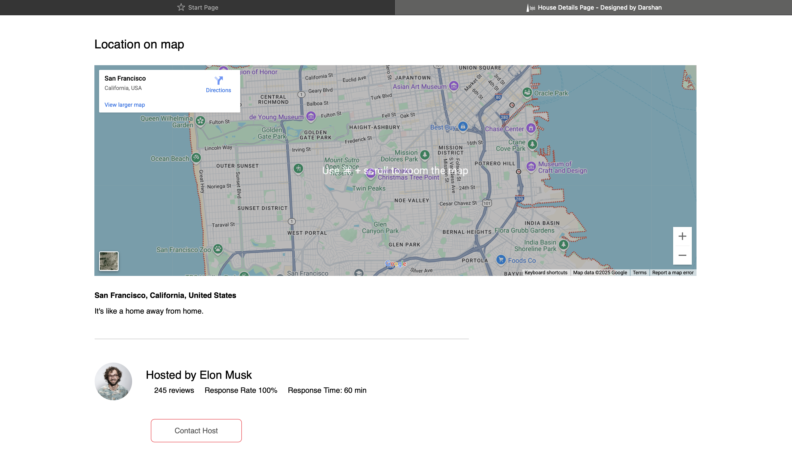

🏡 Homely – Your Next Stay Awaits

Homely is a **modern and responsive property booking frontend** project built using **HTML, CSS, and JavaScript**.  
This project replicates the **Airbnb experience** with custom branding, property listings, trending places, and property details pages.

> 💡 **Portfolio-Ready:** Demonstrates frontend UI/UX and responsive web design skills.

---

## ✨ Features

- 🏠 Landing Page with hero search bar (location, date, guests)
- 🌎 Trending & Exclusive Places with hover animations
- 📋 Property Listing Pages with pagination
- 🏡 Property Details Page with image gallery & Google Maps
- 📝 Footer with About Section and Copyright
- 🎨 Fully responsive design for all devices
- ⚡ Lightweight & fast (pure HTML, CSS, JS)

---

## 🖥 Tech Stack

- **HTML5** – Semantic structure  
- **CSS3 (Flexbox & Grid)** – Styling & responsive layouts  
- **Vanilla JavaScript** – Interactivity  
- **Google Maps Embed** – Location preview

---

## 📸 Screenshots

### 1️⃣ Landing Page


### 2️⃣ Exclusive & Trending Places


### 3️⃣ Property Details Page with Map & Reviews


### 4️⃣ Recommended Listings


### 5️⃣ Listings with Pagination


### 6️⃣ Places Section


### 7️⃣ Footer & About Section


---

## 💻 Run Locally

1️⃣ Clone the Repository  
```bash
git clone https://github.com/DarshanRedddy/Homely.git
cd Homely
2️⃣ Open Locally

Open index.html in any browser

OR use VS Code Live Server for auto reload

OR run:

bash
Copy
Edit
python -m http.server 5500
Open → http://127.0.0.1:5500/index.html

🚀 Deployment Options
GitHub Pages → Easiest static hosting

Vercel → Quick free frontend hosting

Netlify → Drag & drop your folder

🎯 Future Enhancements
🔹 Add backend booking system (Node.js / Django / Firebase)

🔹 Implement search & filtering logic

🔹 Add reviews & ratings for properties

🔹 Display live map with property markers
